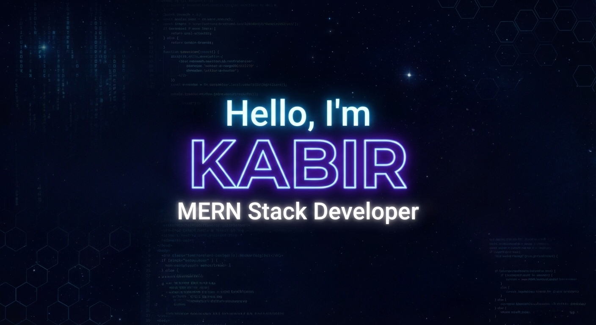

  

<h1 align="center">Hi there, I'm Md Khairul Kabir</h1>
<h3 align="center">🚀 Frontend Developer | Web Developer | Tech Enthusiast</h3>

  
  📍 Rajshahi, Bangladesh &nbsp; | &nbsp; 📧 <a href="mailto:ikkabir24@yahoo.com">ikkabir24@yahoo.com</a> &nbsp; | &nbsp; 📞 <a href="tel:+8801890995309">+880 1890-995309</a>

---

### 👨‍💻 About Me
I am a passionate developer focused on creating interactive and user-friendly web experiences. I have a strong foundation in web technologies and a keen eye for design. I love solving complex problems and turning ideas into reality through code. When I'm not coding, I am exploring new tech trends or contributing to open-source projects.

---

### ⚡ Current Activities
- 💼 I am actively seeking opportunities as a **Junior Frontend / Web Developer**.
- 🎓 I am currently preparing for professional roles through **SCIC by Programming Hero**.
- 🚀 I am focused on leveling up my **Frontend skills from Beginner to Intermediate**.
- 🌱 I am currently exploring **Advanced React patterns and Next.js**.
- 👯 I’m looking to collaborate on **beginner-friendly open source projects**.

---

### 🛠️ Languages and Tools

**Frontend**

  
  
  
  
  

**Backend & Database**

  
  
  

**Tools & DevOps**

  
  
  

---

### 📊 GitHub Analytics

  

    
  

  

    
  

---

### 🤝 Connect with me

  
  
  
  

